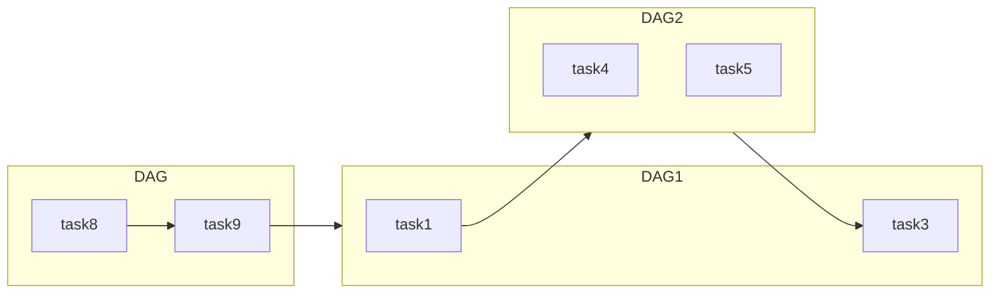
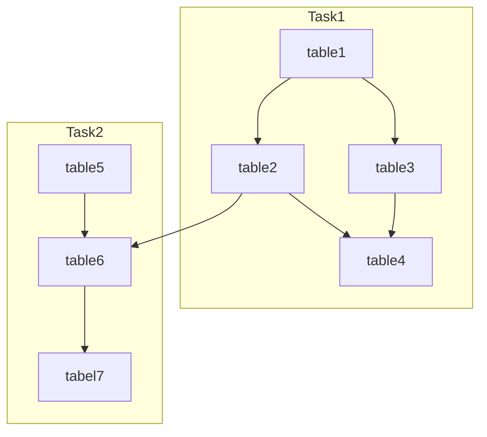

## 前言

为了追踪数据的来源以及处理过程，通过数据的血缘关系能够图形可视化达到一目了然。并基于AIRFLOW任务调度的使用，支撑起现阶段数据的生产。本文就给大家介绍一下数据构建工具DBT：

## DBT介绍


DBT(Data build tool)使数据分析师和工程师能够使用软件工程师构建应用程序的相同做法来转换他们的数据。DBT 是 ELT 中的 T。对仓库中的原始数据进行组织、清理、去正常化、过滤、重命名和预聚合，以便为分析做好准备。

### 功能介绍

-  **DBT连接到您的数据仓库以运行数据转换查询。** 因此，您需要一个加载了源数据的数据仓库才能使用 。DBT 原生支持与 Snowflake、BigQuery、Redshift、Mysql 和 Postgres 数据仓库的连接。

- **DBT 处理样板代码以将查询具体化为关系。** 对于您创建的每个模型，您都可以轻松配置具体*化*。

- **DBT确定模型执行顺序。** 通常在转换数据时，分阶段进行是有意义的。[DBT 提供了一种通过ref](https://docs.getdbt.com/reference/dbt-jinja-functions/ref)函数分阶段实现转换的机制。


DBT 基于模型之间的相互依赖关系构建有向无环图（DAG）——图中的每个节点代表一个模型，节点之间的边由ref函数定义，其中函数中指定的模型ref被识别为当前模型的前身模型。

- **文档：** DBT 提供了一种机制来为您的 DBT 模型编写、版本控制和共享文档。可以为每个模型和字段编写描述（纯文本或降价）。
- **测试：** SQL 可能很难测试，因为底层数据经常变化。DBT 提供了一种通过对模型生成的结果进行断言来提高每个模型中 SQL 完整性的方法
- **包管理：** DBT 附带一个包管理器，它允许分析人员使用和发布 DBT 代码的公共和私有存储库，然后其他人可以引用这些存储库。
- **代码编译器：** 在 DBT 中，SQL 文件可以包含 Jinja，一种轻量级的模板语言。在 SQL 中使用 Jinja 提供了一种在查询中使用控制结构（例如if语句和for循环）的方法。
- **种子文件加载器：** 通常在分析中，原始值需要映射到更易读的值（例如将国家代码转换为国家名称）或使用静态或不经常变化的数据进行丰富（例如使用每年设定的收入目标来评估你的实际情况）。
- **数据快照：** 通常数据源中的记录是可变的，因为它们会随着时间而变化。如果您想重建历史值，这在分析中可能难以处理。
- [官方文档](https://docs.getdbt.com/docs/introduction/)

### DBT优势

1. 如官网述，开发只用关注逻辑代码的开发，不用关注表及视图的创建，不用关注代码执行顺序，DBT框架自动实现这些工作；
2. DBT框架已定义一套数据开发流程及规范，可以约束项目的规范性；
3. DBT框架已抽象出的通用功能，可以降低工作复杂度及重复性编码工作，如：数据探查，将探查的内容，在配置文件定义，DBT自动输出探查结果，避免开发代码，降低数据探查难度；

### DBT不足

1. DBT目前只能从文件读原始数据，如，CSV文件；
2. 支持的数据仓库种类偏少，如：Postgres，Presto，Spark、Mysql等，若使用其他数据仓库，需开发DBT插件；
3. 数据逻辑处理代码，需根据.sql配置文件的格式定义，实际的项目中，数据代码达到上百行，在.sql配置文件格式的规范下，代码管理复杂度会提升，复杂的项目.sql配置文件数量会很多，带来代码梳理及管理上的复杂度；
4. 实际项目数据对象的字段会比较多，.yml配置文件定义字段，会比比较繁琐；

## 实战操作

### 调用链说明

- AIRFLOW任务链

> DAG：由多个Task（函数、SQL、JSON等）任务组成。
> DAG1：串行任务组 （串行+并行服务）
> DAG2：并行任务组 （并行服务）
> DAG3：串行任务组（串行服务）




- DBT任务链

> Task：由一个SQL语句，多张数据表构成。 
> Task1：一张或多张表SQL语句
> Task2：一张或多张表SQL语句
>
> 数据链路更新说明：
> table1数据发生变化（增删改），table2、table3、table4、table6、table7数据表会进行更新。




### 血缘生成

- 使用SQL语句进行连表，JOIN关键词会自动生成血缘关联关系。
- DBT使用方式：[相关链接](https://ewkb.atlassian.net/wiki/spaces/CECP/pages/2685831581/dbt)。

```sql
{{
    config(materialized="table")
}}

-- with fct_gg as (
--     select * from {{ ref("fct_gg") }}
-- ),
-- fct_gg_1 as (
--     select * from {{ ref("fct_gg_1") }}
-- )

select 
  fct_gg.account,
  fct_gg.amazon_order_id
from (select * from {{ ref("fct_gg") }}) fct_gg
left join (select * from {{ ref("fct_gg_1") }}) fct_gg_1 on fct_gg_1.pk = fct_gg.pk
```


### DBT与AIRFLOW的操作

#### [AIRFLOW](https://ewkb.atlassian.net/wiki/spaces/CECP/pages/2674495836/airflow)服务

- 调用DBT服务日志将故障、执行情况日志记录下来。

  - DBT的服务可以通过AIRFLOW定时启用。

- AIRFLOW列表：
 
  

- AIRFLOW中DBT服务具体执行详情日志

  

#### [DBT](https://ewkb.atlassian.net/wiki/spaces/CECP/pages/2685831581/dbt)服务

- DBT数据模型列表

- 数据模型详情

- 数据模型字段描述

- 数据模型字段列

- 数据模型映射关系

- 数据模型SQL语句

  

- 数据模型关系血缘图

  

#### 实现方式

- AIRFLOW服务进行数据对比，通过bash调用DBT服务，DBT实现数据链更新。

```bash
from airflow.utils.dates import days_ago
from airflow import DAG
from airflow.operators.bash_operator import BashOperator
from airflow.utils.dates import datetime
from airflow.utils.dates import timedelta

default_args = {
    'owner': 'tl',
    'email_on_failure': False,
    'email_on_retry': False,
    'retries': 1,
    'retry_delay': timedelta(seconds=30),
}

with DAG(
    'dbt_two',
    default_args=default_args,
    schedule_interval="@once",
    start_date=days_ago(2),
    catchup=False,
    max_active_runs=1,
) as dag:

    start = BashOperator(
        task_id='start',
        bash_command='cd /opt/airflow && dbt run --project-dir doris --profiles-dir doris',
        dag=dag
    )
  
    start 
```